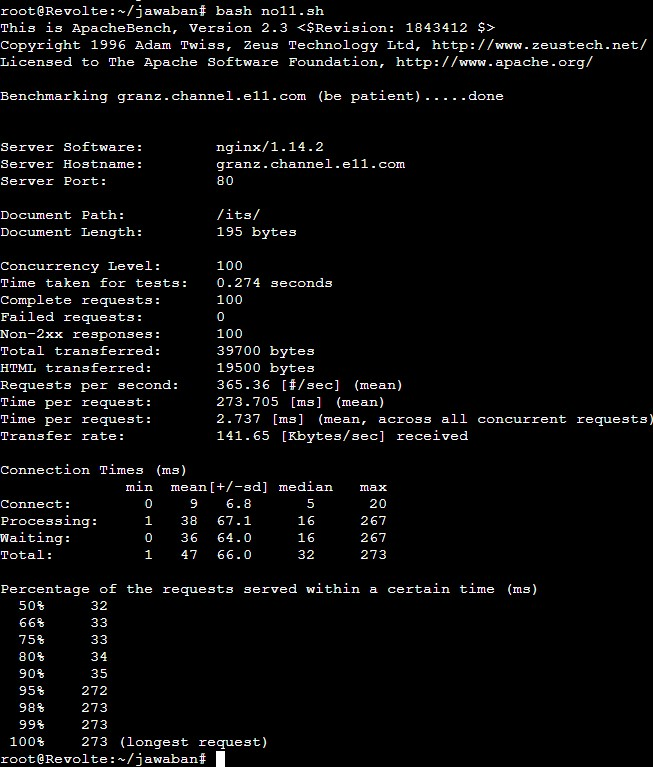
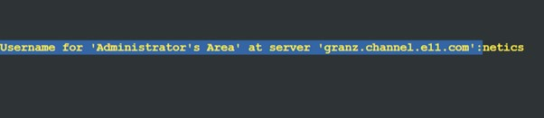
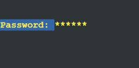
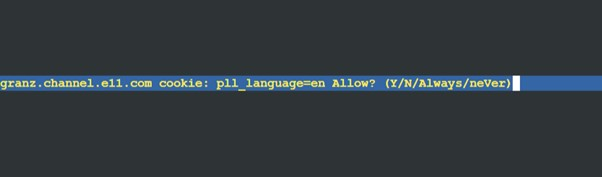
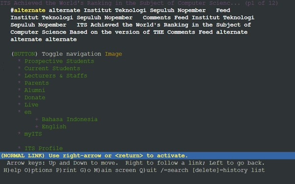
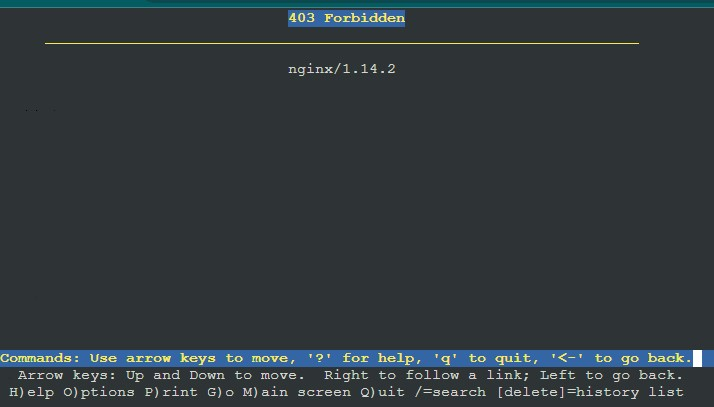
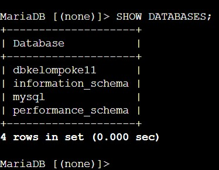
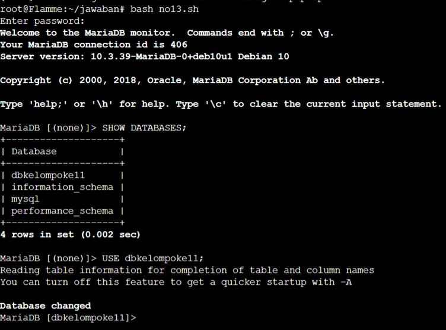
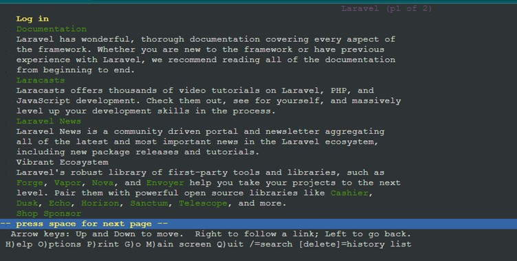
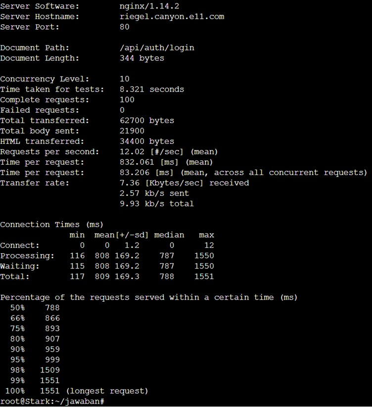

# Jarkom-Modul-3-E11-2023

Laporan resmi praktikum Jaringan Komputer modul 3 kelompok E11

| Nama                       | NRP        |
| -------------------------- | ---------- |
| Sarah Nurhasna Khairunnisa | 5025211105 |
| Tsabita Putri Ramadhany    | 5025211130 |

# Daftar Isi

- [SOAL](#soal)
- [JAWABAN](#jawaban)
  - [NO 0](#no-0)
  - [NO 1](#no-1)
  - [NO 2](#no-2)
  - [NO 3](#no-3)
  - [NO 4](#no-4)
  - [NO 5](#no-5)
  - [NO 2-5](#no-2-5)
  - [NO 6](#no-6)
  - [NO 7](#no-7)
  - [NO 8](#no-8)
  - [NO 9](#no-9)
  - [NO 10](#no-10)
  - [NO 11](#no-11)
  - [NO 12](#no-12)
  - [NO 13](#no-13)
  - [NO 14](#no-14)
  - [NO 15](#no-15)
  - [NO 16](#no-16)
  - [NO 17](#no-17)
  - [NO 18](#no-18)
  - [NO 19](#no-19)
  - [NO 20](#no-20)
- [KENDALA](#kendala)

# Soal
Perjalanan selanjutnya akan menggunakan peta berikut:


dengan ketentuan sebagai berikut:
| Node | Kategori | Image Docker | Konfigurasi IP |
|--------|---------------------|--------------------------------|----------------|
| Aura | Router (DHCP Relay) | danielcristh0/debian-buster:1.1| Dynamic |
| Himmel | DHCP Server | danielcristh0/debian-buster:1.1| Static |
| Heiter | DNS Server | danielcristh0/debian-buster:1.1| Static |
| Denken | Database Server | danielcristh0/debian-buster:1.1| Static |
| Eisen | Load Balancer | danielcristh0/debian-buster:1.1| Static |
| Frieren| Laravel Worker | danielcristh0/debian-buster:1.1| Static |
| Flamme | Laravel Worker | danielcristh0/debian-buster:1.1| Static |
| Fern | Laravel Worker | danielcristh0/debian-buster:1.1| Static |
| Lawine | PHP Worker | danielcristh0/debian-buster:1.1| Static |
| Linie | PHP Worker | danielcristh0/debian-buster:1.1| Static |
| Lugner | PHP Worker | danielcristh0/debian-buster:1.1| Static |
| Revolte| Client | danielcristh0/debian-buster:1.1| Dynamic |
| Richter| Client | danielcristh0/debian-buster:1.1| Dynamic |
| Sein | Client | danielcristh0/debian-buster:1.1| Dynamic |
| Stark | Client | danielcristh0/debian-buster:1.1| Dynamic |

Setelah mengalahkan Demon King, perjalanan berlanjut. Kali ini, kalian diminta untuk melakukan register domain berupa **riegel.canyon.yyy.com** untuk worker Laravel dan **granz.channel.yyy.com** untuk worker PHP **(0)** mengarah pada worker yang memiliki IP [prefix IP].x.1.

**(1)** Lakukan konfigurasi sesuai dengan peta yang sudah diberikan.

Kemudian, karena masih banyak spell yang harus dikumpulkan, bantulah para petualang untuk memenuhi kriteria berikut.:

1. Semua **CLIENT** harus menggunakan konfigurasi dari DHCP Server.
2. Client yang melalui Switch3 mendapatkan range IP dari [prefix IP].3.16 - [prefix IP].3. dan [prefix IP].3.64 - [prefix IP].3.80 **(2)**
3. Client yang melalui Switch4 mendapatkan range IP dari [prefix IP].4.12 - [prefix IP].4.20 dan [prefix IP].4.160 - [prefix IP].4.168 **(3)**
4. Client mendapatkan DNS dari Heiter dan dapat terhubung dengan internet melalui DNS tersebut **(4)**
5. Lama waktu DHCP server meminjamkan alamat IP kepada Client yang melalui Switch3 selama 3 menit sedangkan pada client yang melalui Switch4 selama 12 menit. Dengan waktu maksimal dialokasikan untuk peminjaman alamat IP selama 96 menit **(5)**

Berjalannya waktu, petualang diminta untuk melakukan deployment.

1.  Pada masing-masing worker PHP, lakukan konfigurasi virtual host untuk website berikut (https://drive.google.com/file/d/1ViSkRq7SmwZgdK64eRbr5Fm1EGCTPrU1/view) dengan menggunakan php 7.3. **(6)**
2.  Kepala suku dari Bredt Region memberikan resource server sebagai berikut:

    a. Lawine, 4GB, 2vCPU, dan 80 GB SSD.

    b. Linie, 2GB, 2vCPU, dan 50 GB SSD.

    c. Lugner 1GB, 1vCPU, dan 25 GB SSD.

    aturlah agar Eisen dapat bekerja dengan maksimal, lalu lakukan testing dengan 1000 request dan 100 request/second. **(7)**

3.  Karena diminta untuk menuliskan grimoire, buatlah analisis hasil testing dengan 200 request dan 10 request/second masing-masing algoritma Load Balancer dengan ketentuan sebagai berikut:

        a. Nama Algoritma Load Balancer

        b. Report hasil testing pada Apache Benchmark

        c. Grafik request per second untuk masing masing algoritma.

    Analisis **(8)**

4.  Dengan menggunakan algoritma Round Robin, lakukan testing dengan menggunakan 3 worker, 2 worker, dan 1 worker sebanyak 100 request dengan 10 request/second, kemudian tambahkan grafiknya pada grimoire. **(9)**
5.  Selanjutnya coba tambahkan konfigurasi autentikasi di LB dengan dengan kombinasi username: “netics” dan password: “ajkyyy”, dengan yyy merupakan kode kelompok. Terakhir simpan file “htpasswd” nya di /etc/nginx/rahasisakita/ **(10)**
6.  Lalu buat untuk setiap request yang mengandung /its akan di proxy passing menuju halaman https://www.its.ac.id. **(11) hint: (proxy_pass)**
7.  Selanjutnya LB ini hanya boleh diakses oleh client dengan IP [Prefix IP].3.69, [Prefix IP].3.70, [Prefix IP].4.167, dan [Prefix IP].4.168. **(12) hint: (fixed in dulu clinetnya)**

Karena para petualang kehabisan uang, mereka kembali bekerja untuk mengatur **riegel.canyon.yyy.com.**

1. Semua data yang diperlukan, diatur pada Denken dan harus dapat diakses oleh Frieren, Flamme, dan Fern. **(13)**
2. Frieren, Flamme, dan Fern memiliki Riegel Channel sesuai dengan quest guide berikut (https://github.com/martuafernando/laravel-praktikum-jarkom). Jangan lupa melakukan instalasi PHP8.0 dan Composer **(14)**
3. Riegel Channel memiliki beberapa endpoint yang harus ditesting sebanyak 100 request dengan 10 request/second. Tambahkan response dan hasil testing pada grimoire.

   a. POST /auth/register **(15)**

   b. POST /auth/login **(16)**

   c. GET /me **(17)**

4. Untuk memastikan ketiganya bekerja sama secara adil untuk mengatur Riegel Channel maka implementasikan Proxy Bind pada Eisen untuk mengaitkan IP dari Frieren, Flamme, dan Fern. **(18)**
5. Untuk meningkatkan performa dari Worker, coba implementasikan PHP-FPM pada Frieren, Flamme, dan Fern. Untuk testing kinerja naikkan

   - pm.max_children
   - pm.start_servers
   - pm.min_spare_servers
   - pm.max_spare_servers

   sebanyak tiga percobaan dan lakukan testing sebanyak 100 request dengan 10 request/second kemudian berikan hasil analisisnya pada Grimoire. **(19)**

6. Nampaknya hanya menggunakan PHP-FPM tidak cukup untuk meningkatkan performa dari worker maka implementasikan Least-Conn pada Eisen. Untuk testing kinerja dari worker tersebut dilakukan sebanyak 100 request dengan 10 request/second. **(20)**

**PS:**
Grimoire dikumpulkan dalam bentuk PDF dengan format yyy_Grimoire.pdf.
yyy merupakan kode kelompok

# Jawaban

## NO 0

Membuat topologi


- Buat projek baru pada GNS3
- Drag node NAT1 ke halaman
- Drag node debian-1 ke halaman
- Ganti nama dan simbol debian-1 menjadi nama node-node yang diperlukan
- Drag 4 node switch ke halaman
- Link setiap node sesuai dengan ketentuan topologi
- Setting network masing-masing node sesuai dengan prefix kelompok (10.42)

## NO 1

Setting network masing-masing node

1. AURA - ROUTER (DHCP RELAY)
    
    ```bash
    auto eth0
    iface eth0 inet dhcp
    
    auto eth1
    iface eth1 inet static
      address 10.42.1.42
      netmask 255.255.255.0
    
    auto eth2
    iface eth2 inet static
      address 10.42.2.42
      netmask 255.255.255.0
    
    auto eth3
    iface eth3 inet static
      address 10.42.3.42
      netmask 255.255.255.0
    
    auto eth4
    iface eth4 inet static
      address 10.42.4.42
      netmask 255.255.255.0
    ```

2. Switch 1

   a. HIMMEL - DHCP SERVER

   ```bash
   auto eth0
   iface eth0 inet static
     address 10.42.1.1
     netmask 255.255.255.0
     gateway 10.42.1.42
   ```

   b. HEITER - DNS SERVER

   ```bash
   auto eth0
   iface eth0 inet static
     address 10.42.1.2
     netmask 255.255.255.0
     gateway 10.42.1.42
   ```

3. Switch 2

   a. DENKEN - DATABASE SERVER

   ```bash
   auto eth0
   iface eth0 inet static
     address 10.42.2.1
     netmask 255.255.255.0
     gateway 10.42.2.42
   ```

   b. EISEN - LOAD BALANCER

   ```bash
   auto eth0
   iface eth0 inet static
     address 10.42.2.2
     netmask 255.255.255.0
     gateway 10.42.2.42
   ```

4. Switch 3

   a. LUGNER - PHP WORKER

   ```bash
   auto eth0
   iface eth0 inet dhcp
   ```

   b. LINIE - PHP WORKER

   ```bash
   auto eth0
   iface eth0 inet dhcp
   ```

   c. LAWINE - PHP WORKER

   ```bash
   auto eth0
   iface eth0 inet dhcp
   ```

   d. RICHTER - CLIENT

   ```bash
   auto eth0
   iface eth0 inet dhcp
   ```

   e. REVOLTE - CLIENT

   ```bash
   auto eth0
   iface eth0 inet dhcp
   ```

5. Switch 4

   a. SEIN - CLIENT

   ```bash
   auto eth0
   iface eth0 inet dhcp
   ```

   b. STARK - CLIENT

   ```bash
   auto eth0
   iface eth0 inet dhcp
   ```

   c. FRIEREN - LARAVEL WORKER

   ```bash
   auto eth0
   iface eth0 inet dhcp
   ```

   d. FLAMME - LARAVEL WORKER

   ```bash
   auto eth0
   iface eth0 inet dhcp
   ```

   e. FERN - LARAVEL WORKER

   ```bash
   auto eth0
   iface eth0 inet dhcp
   ```

Mengatur konfigurasi `.bashrc` masing-masing node

```bash
nano /root/.bashrc
cd /root/jawaban
```

1. ALL NODE

   ```bash
   echo nameserver 192.168.122.1 > /etc/resolv.conf
   ```

2. AURA - ROUTER (DHCP RELAY)

   ```bash
   iptables -t nat -A POSTROUTING -o eth0 -j MASQUERADE -s 10.42.0.0/16
   echo nameserver 192.168.122.1 > /etc/resolv.conf
   apt-get update
   apt-get install isc-dhcp-relay -y
   cd /root/jawaban
   ```

3. HEITER - DNS SERVER

   ```bash
   echo nameserver 192.168.122.1 > /etc/resolv.conf
   apt-get update
   apt-get install bind9 -y
   cd /root/jawaban
   ```

4. HIMMEL - DHCP SERVER

   ```bash
   echo nameserver 192.168.122.1 > /etc/resolv.conf
   apt-get update
   apt-get install isc-dhcp-server -y
   cd /root/jawaban
   ```

5. EISEN - LOAD BALANCER

   ```bash
   echo nameserver 192.168.122.1 > /etc/resolv.conf
   apt-get update
   apt-get install nginx -y
   apt-get install htop -y
   cd /root/jawaban
   ```

6. WORKER - PHP (Lawine, Linie, Lugner)

   ```bash
   echo nameserver 192.168.122.1 > /etc/resolv.conf
   apt-get update
   apt install nginx php php-fpm -y
   apt-get install wget -y
   apt-get install unzip -y
   apt-get install htop -y
   apt-get install apache2-utils -y
   cd /root/jawaban
   ```

7. DENKEN - DATABASE SERVER

   ```bash
   echo nameserver 192.168.122.1 > /etc/resolv.conf
   apt-get update
   apt-get install mariadb-server -y
   service mysql start
   cd /root/jawaban
   ```

8. WORKER - LARAVEL (Frieren, Flamme, Fern)

   ```bash
   echo nameserver 192.168.122.1 > /etc/resolv.conf
   apt-get update
   apt-get install mariadb-client -y
   apt-get update
   apt-get install -y lsb-release ca-certificates apt-transport-https software-properties-common gnupg2
   curl -sSLo /usr/share/keyrings/deb.sury.org-php.gpg https://packages.sury.org/php/apt.gpg
   sh -c 'echo "deb [signed-by=/usr/share/keyrings/deb.sury.org-php.gpg] https://packages.sury.org/php/ $(lsb_release -sc) main" > /etc/apt/sources.list.d/php.list'
   apt-get update
   apt-get install php8.0-mbstring php8.0-xml php8.0-cli php8.0-common php8.0-intl php8.0-opcache php8.0-readline php8.0-mysql php8.0-fpm php8.0-curl unzip wget -y
   echo nameserver 192.168.122.1 > /etc/resolv.conf
   apt-get install nginx -y
   apt-get update
   apt-get install git -y
   echo nameserver 192.168.122.1 > /etc/resolv.conf
   apt-get install lynx -y
   service nginx start
   service php8.0-fpm start
   cd /root/jawaban
   ```

9. CLIENT (Revolte, Richter, Sein, Stark)
   ```bash
   echo nameserver 192.168.122.1 > /etc/resolv.conf
   apt-get update
   apt-get install lynx -y
   echo nameserver 192.168.122.1 > /etc/resolv.conf
   apt-get install apache2-utils -y
   apt install nginx -y
   cd /root/jawaban
   ```

**HEITER - DNS SERVER**

1. buat script no1.sh

   ```bash
   nano no1.sh
   ```

2. isi script

   ```bash
   mkdir -p /etc/bind/jarkom

   echo '
   zone "canyon.e11.com" {
     type master;
     file "/etc/bind/jarkom/canyon.e11.com";
   };

   zone "channel.e11.com" {
     type master;
     file "/etc/bind/jarkom/channel.e11.com";
   };
   ' > /etc/bind/named.conf.local

   # worker laravel
   echo '
   ;
   ; BIND data file for local loopback interface
   ;
   $TTL    604800
   @       IN      SOA     canyon.e11.com. root.canyon.e11.com. (
                                 2         ; Serial
                           604800         ; Refresh
                             86400         ; Retry
                           2419200         ; Expire
                           604800 )       ; Negative Cache TTL
   ;
   @       IN      NS      canyon.e11.com.
   @       IN      A       10.42.2.2 ; IP EISEN LB
   riegel  IN      A       10.42.4.1 ; IP Fern LARAVEL WORKER
   @       IN      AAAA    ::1
   ' > /etc/bind/jarkom/canyon.e11.com

   # worker PHP
   echo '
   ;
   ; BIND data file for local loopback interface
   ;
   $TTL    604800
   @       IN      SOA     channel.e11.com. root.channel.e11.com. (
                                 2         ; Serial
                           604800         ; Refresh
                             86400         ; Retry
                           2419200         ; Expire
                           604800 )       ; Negative Cache TTL
   ;
   @       IN      NS      channel.e11.com.
   @       IN      A       10.42.2.2 ; IP EISEN LB
   granz   IN      A       10.42.3.1 ; IP Lugner PHP WORKER
   @       IN      AAAA    ::1
   ' > /etc/bind/jarkom/channel.e11.com

   echo 'options {
         directory "/var/cache/bind";

         forwarders {
                 192.168.122.1;
         };

         // dnssec-validation auto;
         allow-query{any;};
         auth-nxdomain no;    # conform to RFC1035
         listen-on-v6 { any; };
   }; ' >/etc/bind/named.conf.options

   service bind9 restart
   ```

   - membuat direktori `jarkom` di dalam direktori `/etc/bind`, yang biasanya digunakan untuk menyimpan file konfigurasi BIND.
   - Konfigurasi Zona DNS
     - File `named.conf.local` diperbarui dengan informasi zona untuk dua domain: `canyon.e11.com` dan `channel.e11.com`.
     - Setiap zona dideklarasikan sebagai `type master`, yang berarti server ini akan menjadi sumber otoritatif untuk zona tersebut.
     - Lokasi file zona untuk setiap domain ditunjukkan (`/etc/bind/jarkom/canyon.e11.com` dan `/etc/bind/jarkom/channel.e11.com`).
   - File Zona untuk Domain canyon.e11.com (worker Laravel)
     - `A` record untuk root domain (`@`) mengarah ke IP Load Balancer (`10.42.2.2`), dan subdomain riegel mengarah ke IP worker Laravel (`10.42.4.1`).
   - File Zona untuk Domain channel.e11.com (worker PHP)
     - Mirip dengan konfigurasi zona `canyon.e11.com`, namun `A` record untuk subdomain `granz` mengarah ke IP worker PHP (`10.42.3.1`).
   - Konfigurasi Opsi DNS:
     - Direktori cache untuk BIND ditetapkan pada `/var/cache/bind`.
     - `forwarders` digunakan untuk menentukan DNS server lain yang akan di-query jika server lokal tidak dapat menyelesaikan nama domain.
     - `allow-query{any;};` memungkinkan semua alamat IP untuk melakukan query ke server ini.
     - Beberapa parameter lainnya diset untuk mengonfigurasi bagaimana BIND harus beroperasi.
   - Restart Service: `service bind9 restart` akan memulai ulang service BIND9 untuk menerapkan perubahan konfigurasi yang baru dibuat.

**TESTING**

1. HEITER (DNS SERVER)

   ```bash
   bash no1.sh
   ```

   

2. CLIENT

   `nano no1.sh`

   ```bash
   echo '
   nameserver 10.42.1.2 # IP heiter
   ' > /etc/resolv.conf

   ping riegel.canyon.e11.com -c 5

   ping granz.channel.e11.com -c 5
   ```

   `bash no1.sh`
   
   

## NO 2
1. Konfigurasi DHCP Server

    **a. HIMMEL - DHCP SERVER**
    ```bash
    echo -e '
    subnet 10.42.1.0 netmask 255.255.255.0 {
    }

    subnet 10.42.2.0 netmask 255.255.255.0 {
    }

    subnet 10.42.3.0 netmask 255.255.255.0 {
    }

    subnet 10.42.4.0 netmask 255.255.255.0 {
    }
    ' > /etc/dhcp/dhcpd.conf
    ```
    **b. AURA - DHCP RELAY**
    ```bash
    # apt-get update
    # apt-get install isc-dhcp-relay -y

    echo -e '
        SERVERS="10.42.1.1"  #IP HIMMEL DHCP SERVER
        INTERFACES="eth1 eth2 eth3 eth4"
    ' > /etc/default/isc-dhcp-relay

    # konfigurasi IP forwarding
    echo '
        net.ipv4.ip_forward=1
    ' > /etc/sysctl.conf

    service isc-dhcp-relay restart
    ```

2. Client yang melalui Switch3 mendapatkan range IP dari [prefix IP].3.16 - [prefix IP].3.32 dan [prefix IP].3.64 - [prefix IP].3.80

    **HIMMEL - DHCP SERVER**
      ```bash
      subnet 10.42.3.0 netmask 255.255.255.0 {
        range 10.42.3.16 10.42.3.32;
        range 10.42.3.64 10.42.3.80;
      }
      ```

## NO 3
Client yang melalui Switch4 mendapatkan range IP dari [prefix IP].4.12 - [prefix IP].4.20 dan [prefix IP].4.160 - [prefix IP].4.168

 **HIMMEL - DHCP SERVER**
 ```bash
  subnet 10.42.4.0 netmask 255.255.255.0 {
    range 10.42.4.12 10.42.4.20;
    range 10.42.4.160 10.42.4.168;
  }
 ```

## NO 4
Client mendapatkan DNS dari Heiter dan dapat terhubung dengan internet melalui DNS tersebut

 **HIMMEL - DHCP SERVER**
 ```bash
  subnet 10.42.3.0 netmask 255.255.255.0 {
    option routers 10.42.3.42;
    option broadcast-address 10.42.3.255;
    option domain-name-servers 10.42.1.2;	# IP HEITER DNS SERVER
  }

  subnet 10.42.4.0 netmask 255.255.255.0 {
    option routers 10.42.4.42;
    option broadcast-address 10.42.4.255;
    option domain-name-servers 10.42.1.2;	# IP HEITER DNS SERVER
  }
 ```

## NO 5
Lama waktu DHCP server meminjamkan alamat IP kepada Client yang melalui Switch3 selama 3 menit sedangkan pada client yang melalui Switch4 selama 12 menit. Dengan waktu maksimal dialokasikan untuk peminjaman alamat IP selama 96 menit

 **HIMMEL - DHCP SERVER**
 ```bash
  subnet 10.42.3.0 netmask 255.255.255.0 {
    default-lease-time 180;	# 3 menit
    max-lease-time 5760;		# 96 menit
  }

  subnet 10.42.4.0 netmask 255.255.255.0 {
    default-lease-time 720;	# 12 menit
    max-lease-time 5760;		# 96 menit
  }
 ```

## NO 2-5
1. buat fixed address untuk php dan laravel worker karena di ketentuan soal worker memiliki konfigurasi IP static. Tapi soal 2 - 5 meminta client yang melewati switch3 dan 4 mendapatkan IP berbeda

2. full script no2-5.sh

    **a. HIMMEL - DHCP SERVER**
      ```bash
      # simpan di bashrc
      # apt update
      # apt install isc-dhcp-server -y
      # dhcpd --version

      # tentukan interface
      echo '
      INTERFACESv4="eth0"
      ' > /etc/default/isc-dhcp-server

      echo -e '
          subnet 10.42.1.0 netmask 255.255.255.0 {
          }

          subnet 10.42.2.0 netmask 255.255.255.0 {
          }

          subnet 10.42.3.0 netmask 255.255.255.0 {
              range 10.42.3.16 10.42.3.32;
              range 10.42.3.64 10.42.3.80;
              option routers 10.42.3.42;
              option broadcast-address 10.42.3.255;
              option domain-name-servers 10.42.1.2; # IP HEITER DNS SERVER
              default-lease-time 180; # 3 menit
              max-lease-time 5760; # 96 menit
          }

          subnet 10.42.4.0 netmask 255.255.255.0 {
              range 10.42.4.12 10.42.4.20;
              range 10.42.4.160 10.42.4.168;
              option routers 10.42.4.42;
              option broadcast-address 10.42.4.255;
              option domain-name-servers 10.42.1.2; # IP HEITER DNS SERVER
              default-lease-time 720; # 12 menit
              max-lease-time 5760; # 96 menit
          }
      ' > /etc/dhcp/dhcpd.conf

      # fixed address
      echo '
      # php worker

      host Lugner {
          hardware ethernet 72:95:80:87:45:80;
          fixed-address 10.42.3.1;
      }

      host Linie {
          hardware ethernet f6:75:7a:b2:40:f6;
          fixed-address 10.42.3.2;
      }

      host Lawine {
          hardware ethernet d2:59:de:82:be:e1;
          fixed-address 10.42.3.3;
      }

      # laravel worker
      host Fern {
          hardware ethernet e2:04:2c:f3:7c:04;
          fixed-address 10.42.4.1;
      }

      host Flamme {
          hardware ethernet 6a:a3:9f:7e:64:a2;
          fixed-address 10.42.4.2;
      }

      host Frieren {
          hardware ethernet 6a:14:d7:37:d9:c9;
          fixed-address 10.42.4.3;
      }
      ' >> /etc/dhcp/dhcpd.conf

      service isc-dhcp-server restart
      ```
    **b. AURA - DHCP RELAY**
    ```bash
    # apt-get update
    # apt-get install isc-dhcp-relay -y

    echo -e '
        SERVERS="10.42.1.1"  #IP HIMMEL DHCP SERVER
        INTERFACES="eth1 eth2 eth3 eth4"
    ' > /etc/default/isc-dhcp-relay

    # konfigurasi IP forwarding
    echo '
        net.ipv4.ip_forward=1
    ' > /etc/sysctl.conf

    service isc-dhcp-relay restart
    ```
    **c. PHP WORKER (LAWINE, LINIE, LUGNER)**
      ```bash
      # Lawine
      echo '
      auto eth0
      iface eth0 inet dhcp
      hwaddress ether d2:59:de:82:be:e1
      ' > /etc/network/interfaces

      # Linie
      echo '
      auto eth0
      iface eth0 inet dhcp
      hwaddress ether f6:75:7a:b2:40:f6
      ' > /etc/network/interfaces

      # Lugner
      echo '
      auto eth0
      iface eth0 inet dhcp
      hwaddress ether 72:95:80:87:45:80
      ' > /etc/network/interfaces
      ```
    **d. LARAVEL WORKER (FRIEREN, FLAMME, FERN)**
      ```bash
      # Frieren
      echo '
      auto eth0
      iface eth0 inet dhcp
      hwaddress ether 6a:14:d7:37:d9:c9
      ' > /etc/network/interfaces

      # Flamme
      echo '
      auto eth0
      iface eth0 inet dhcp
      hwaddress ether 6a:a3:9f:7e:64:a2
      ' > /etc/network/interfaces

      # Fern
      echo '
      auto eth0
      iface eth0 inet dhcp
      hwaddress ether e2:04:2c:f3:7c:04
      ' > /etc/network/interfaces
      ```
      
**TESTING**
1. HIMMEL - DHCP SERVER
   


3. AURA - DHCP RELAY
   


5. LAWINE
   


7. LINIE


9. LUGNER
    


11. FRIEREN
    


13. FLAMME


15. FERN
    


## NO 6

**PHP WORKER (LAWINE, LINIE, LUGNER)**

```bash
echo '
nameserver 192.168.122.1
' > /etc/resolv.conf

wget -O '/var/www/granz.channel.e11.com.zip' 'https://drive.google.com/u/0/uc?id=1ViSkRq7SmwZgdK64eRbr5Fm1EGCTPrU1&export=download'
unzip -o /var/www/granz.channel.e11.com.zip -d /var/www/
rm -rf /var/www/granz.channel.e11.com.zip

echo '
nameserver 10.42.1.2 # IP heiter
' > /etc/resolv.conf

# nano /etc/nginx/sites-available/jarkom
echo '
 server {
    listen 80;

    root /var/www/modul-3;

    index index.php index.html index.htm;
    server_name _;
    location / {
        try_files $uri $uri/ /index.php?$query_string;
    }

    # pass PHP scripts to FastCGI server
    location ~ \.php$ {
        include snippets/fastcgi-php.conf;
        fastcgi_pass unix:/var/run/php/php7.3-fpm.sock;
    }

    location ~ /\.ht {
        deny all;
    }

    error_log /var/log/nginx/jarkom_error.log;
    access_log /var/log/nginx/jarkom_access.log;
 }
' > /etc/nginx/sites-available/jarkom

# buat symlink
ln -s /etc/nginx/sites-available/jarkom /etc/nginx/sites-enabled/jarkom

# unlink konfigurasi default
unlink /etc/nginx/sites-enabled/default

service php7.3-fpm start
service nginx restart
nginx -t
```

**1. Set DNS Server:** Mengatur file `resolv.conf` untuk menggunakan DNS server dengan alamat IP `192.168.122.1`.

**2. Download Website Archive:** Menggunakan `wget` untuk mengunduh arsip situs web dari Google Drive dan menyimpannya di direktori `/var/www/`.

**3. Ekstrak dan Bersihkan:** Mengekstrak isi arsip yang diunduh ke direktori `/var/www/` dan kemudian menghapus file zip tersebut.

**4. Set DNS Server Baru:** Mengubah konfigurasi DNS server lagi ke `10.42.1.2`

**5. Konfigurasi Virtual Host untuk Nginx:**

- Membuat file konfigurasi baru untuk virtual host di direktori `/etc/nginx/sites-available/`.
- Menentukan `root` direktori tempat file situs web berada.
- Menentukan `server_name` dan konfigurasi untuk menangani PHP scripts.
- Mengamankan akses ke file `.ht` dengan menolak semua permintaan ke file tersebut.
- Menentukan lokasi file log untuk error dan access.

**6. Aktifkan Virtual Host:** Membuat symlink ke direktori `/etc/nginx/sites-enabled/` untuk mengaktifkan konfigurasi virtual host yang baru.

**7. Nonaktifkan Konfigurasi Default:** Menghapus symlink untuk konfigurasi virtual host default dari Nginx.

**8. Mulai Ulang Layanan:** Memulai ulang layanan `php7.3-fpm` dan `nginx` untuk menerapkan perubahan konfigurasi.

**9. Cek Konfigurasi Nginx:** Menjalankan `nginx -t` untuk memeriksa sintaks konfigurasi Nginx dan memastikan tidak ada kesalahan sebelum server mulai menjalankannya.

**TESTING CLIENT (Revolte, Richter, Sein, Stark)**

```bash
# simpan di bashrc
# apt-get install lynx -y
# lugner
lynx http://10.42.3.1
# linie
lynx http://10.42.3.2
# Lawine
lynx http://10.42.3.3

lynx http://granz.channel.e11.com
```


## NO 7

**LOAD BALANCER (EISEN)**

```bash
# nano /etc/nginx/sites-available/lb-jarkom
# default round robin
echo '
upstream worker {
  server 10.42.3.1; # IP Lugner
  server 10.42.3.2; # IP Linie
  server 10.42.3.3; # IP Lawine
}

server {
  listen 80;
  server_name granz.channel.e11.com;

  location / {
    proxy_pass http://worker;
    proxy_set_header    X-Real-IP $remote_addr;
    proxy_set_header    X-Forwarded-For $proxy_add_x_forwarded_for;
    proxy_set_header    Host $http_host;
  }

  error_log /var/log/nginx/lb_error.log;
  access_log /var/log/nginx/lb_access.log;

}
' > /etc/nginx/sites-available/lb-jarkom

# simpan symlink
ln -s /etc/nginx/sites-available/lb-jarkom /etc/nginx/sites-enabled/lb-jarkom

unlink /etc/nginx/sites-enabled/default

service nginx restart
nginx -t
```

1. Konfigurasi Nginx untuk menggunakan metode Round Robin default (setiap server diperlakukan sama).
2. Menetapkan IP server masing-masing (`Lugner`, `Linie`, `Lawine`) dalam grup upstream yang akan dilayani oleh load balancer.
3. Server Load Balancer listen pada port 80 dan memproses permintaan untuk domain `granz.channel.e11.com`.
4. Lokasi `/` akan meneruskan semua permintaan ke grup `upstream` yang telah dikonfigurasi.
5. Menyetel header yang diperlukan untuk proxy, termasuk IP asli pengirim permintaan.
6. Menuliskan log error dan access ke file log yang ditentukan.
7. Menyimpan konfigurasi dan membuat symlink agar Nginx dapat membaca konfigurasi tersebut saat dimulai.
8. Menghapus symlink konfigurasi default Nginx untuk mencegah konflik.
9. Merestart layanan Nginx dan memeriksa konfigurasi dengan `nginx -t`.

**TESTING CLIENT (Revolte, Richter, Sein, Stark)**

```bash
echo '
nameserver 10.42.1.2 # IP heiter
' > /etc/resolv.conf

rm no7.data
ab -n 1000 -c 100 -g no7.data http://granz.channel.e11.com/
```

1. Mengatur DNS server pada client (`Revolte`, `Richter`, `Sein`, `Stark`) untuk memastikan mereka menggunakan DNS server yang tepat (`10.42.1.2`).
2. Menghapus data sebelumnya jika ada (`no7.data`).
3. Menggunakan `ApacheBench (ab)` untuk melakukan 1000 requests ke domain `granz.channel.e11.com` dengan konvensi 100 requests secara bersamaan.
4. Menyimpan hasil benchmark ke file `no7.data`.


## NO 8
1. Weighted Round Robin

    a. LOAD BALANCER (EISEN)
    ```bash
      # nano /etc/nginx/sites-available/lb-jarkom
      echo '
      upstream weightedrb {
        server 10.42.3.1 weight=4; # IP Lugner
        server 10.42.3.2 weight=3; # IP Linie
        server 10.42.3.3 weight=2; # IP Lawine
      }

      server {
        listen 80;
        server_name granz.channel.e11.com;

        location / {
          proxy_pass http://weightedrb;
          proxy_set_header    X-Real-IP $remote_addr;
          proxy_set_header    X-Forwarded-For $proxy_add_x_forwarded_for;
          proxy_set_header    Host $http_host;
        }
        error_log /var/log/nginx/lb_error.log;
        access_log /var/log/nginx/lb_access.log;
      }
      ' > /etc/nginx/sites-available/lb-jarkom

      # simpan symlink
      ln -s /etc/nginx/sites-available/lb-jarkom /etc/nginx/sites-enabled/lb-jarkom

      unlink /etc/nginx/sites-enabled/default

      service nginx restart
      nginx -t
      ```
      
    b. TESTING CLIENT (Revolte, Richter, Sein, Stark)
      ```bash
      rm no8-wrb.data
      ab -n 200 -c 10 -g no8-wrb.data http://granz.channel.e11.com/
      ```
      
      

2. Least Connection

    a. LOAD BALANCER (EISEN)
      ```bash
      # nano /etc/nginx/sites-available/lb-jarkom
      echo '
      upstream least {
        least_conn;
        server 10.42.3.1; # IP Lugner
        server 10.42.3.2; # IP Linie
        server 10.42.3.3; # IP Lawine
      }

      server {
        listen 80;
        server_name granz.channel.e11.com;

        location / {
          proxy_pass http://least;
          proxy_set_header    X-Real-IP $remote_addr;
          proxy_set_header    X-Forwarded-For $proxy_add_x_forwarded_for;
          proxy_set_header    Host $http_host;
        }
        error_log /var/log/nginx/lb_error.log;
        access_log /var/log/nginx/lb_access.log;
      }
      ' > /etc/nginx/sites-available/lb-jarkom

      # simpan symlink
      ln -s /etc/nginx/sites-available/lb-jarkom /etc/nginx/sites-enabled/lb-jarkom

      unlink /etc/nginx/sites-enabled/default

      service nginx restart
      nginx -t
      ```

    b. TESTING CLIENT (Revolte, Richter, Sein, Stark)
      ```bash
      rm no8-leastconnection.data
      ab -n 200 -c 10 -g no8-leastconnection.data http://granz.channel.e11.com/
      ```

      

3. IP Hash

    a. LOAD BALANCER (EISEN)
      ```bash
      # nano /etc/nginx/sites-available/lb-jarkom
      echo '
      upstream iphash {
        ip_hash;
        server 10.42.3.1; # IP Lugner
        server 10.42.3.2; # IP Linie
        server 10.42.3.3; # IP Lawine
      }

      server {
        listen 80;
        server_name granz.channel.e11.com;


        location / {
          proxy_pass http://iphash;
          proxy_set_header    X-Real-IP $remote_addr;
          proxy_set_header    X-Forwarded-For $proxy_add_x_forwarded_for;
          proxy_set_header    Host $http_host;
        }
        error_log /var/log/nginx/lb_error.log;
        access_log /var/log/nginx/lb_access.log;
      }
      ' > /etc/nginx/sites-available/lb-jarkom

      # simpan symlink
      ln -s /etc/nginx/sites-available/lb-jarkom /etc/nginx/sites-enabled/lb-jarkom

      unlink /etc/nginx/sites-enabled/default

      service nginx restart
      nginx -t
      ```

    b. TESTING CLIENT (Revolte, Richter, Sein, Stark)
      ```bash
      rm no8-iphash.data
      ab -n 200 -c 10 -g no8-iphash.data http://granz.channel.e11.com/
      ```

      

4. Generic Hash

    a. LOAD BALANCER (EISEN)
      ```bash
      # nano /etc/nginx/sites-available/lb-jarkom
      echo '
      upstream generichash {
        hash $request_uri consistent;
        server 10.42.3.1; # IP Lugner
        server 10.42.3.2; # IP Linie
        server 10.42.3.3; # IP Lawine
      }


      server {
        listen 80;
        server_name granz.channel.e11.com;


        location / {
          proxy_pass http://generichash;
          proxy_set_header    X-Real-IP $remote_addr;
          proxy_set_header    X-Forwarded-For $proxy_add_x_forwarded_for;
          proxy_set_header    Host $http_host;
        }
        error_log /var/log/nginx/lb_error.log;
        access_log /var/log/nginx/lb_access.log;
      }
      ' > /etc/nginx/sites-available/lb-jarkom

      # simpan symlink
      ln -s /etc/nginx/sites-available/lb-jarkom /etc/nginx/sites-enabled/lb-jarkom

      unlink /etc/nginx/sites-enabled/default
      service nginx restart
      nginx -t
      ```

    b. TESTING CLIENT (Revolte, Richter, Sein, Stark)
      ```bash
      rm no8-generichash.data
      ab -n 200 -c 10 -g no8-generichash.data http://granz.channel.e11.com/
      ```

      
   
## NO 9

**1. LOAD BALANCER (EISEN)**

```bash
# nano /etc/nginx/sites-available/lb-jarkom
# default round robin
echo '
upstream worker {
  server 10.42.3.1; # IP Lugner
  server 10.42.3.2; # IP Linie
  server 10.42.3.3; # IP Lawine
}

server {
  listen 80;
  server_name granz.channel.e11.com;

  location / {
    proxy_pass http://worker;
    proxy_set_header    X-Real-IP $remote_addr;
    proxy_set_header    X-Forwarded-For $proxy_add_x_forwarded_for;
    proxy_set_header    Host $http_host;
  }

  error_log /var/log/nginx/lb_error.log;
  access_log /var/log/nginx/lb_access.log;

}
' > /etc/nginx/sites-available/lb-jarkom

# simpan symlink
ln -s /etc/nginx/sites-available/lb-jarkom /etc/nginx/sites-enabled/lb-jarkom

unlink /etc/nginx/sites-enabled/default

service nginx restart
nginx -t
```

**2. CLIENT (REVOLTE, RICHTER, SEIN, STARK)**

```bash
ab -n 100 -c 10 http://granz.channel.e11.com/
```

**3. PHP WORKER (LAWINE, LINIE, LUGNER)**

```bash
# 2 worker
# stop nginx di salah satu worker (linie)
service nginx stop

# 1 worker
# stop nginx di linie dan lawine
```

**TESTING**

3 worker


2 worker


1 worker


## NO 10

**HEITER (DNS SERVER)**

```bash
mkdir -p /etc/bind/jarkom

echo '
zone "canyon.e11.com" {
  type master;
  file "/etc/bind/jarkom/canyon.e11.com";
};

zone "channel.e11.com" {
	type master;
	file "/etc/bind/jarkom/channel.e11.com";
};
' > /etc/bind/named.conf.local

# worker laravel
echo '
;
; BIND data file for local loopback interface
;
$TTL    604800
@       IN      SOA     canyon.e11.com. root.canyon.e11.com. (
                              2         ; Serial
                         604800         ; Refresh
                          86400         ; Retry
                        2419200         ; Expire
                         604800 )       ; Negative Cache TTL
;
@       IN      NS      canyon.e11.com.
@       IN      A       10.42.2.2 ; IP EISEN LB
riegel  IN      A       10.42.4.1 ; IP Fern LARAVEL WORKER
@       IN      AAAA    ::1
' > /etc/bind/jarkom/canyon.e11.com

# worker PHP
echo '
;
; BIND data file for local loopback interface
;
$TTL    604800
@       IN      SOA     channel.e11.com. root.channel.e11.com. (
                              2         ; Serial
                         604800         ; Refresh
                          86400         ; Retry
                        2419200         ; Expire
                         604800 )       ; Negative Cache TTL
;
@       IN      NS      channel.e11.com.
@       IN      A       10.42.2.2 ; IP EISEN LB
granz   IN      A       10.42.2.2 ; IP EISEN LB
@       IN      AAAA    ::1
' > /etc/bind/jarkom/channel.e11.com

echo 'options {
      directory "/var/cache/bind";

      forwarders {
              192.168.122.1;
      };

      // dnssec-validation auto;
      allow-query{any;};
      auth-nxdomain no;    # conform to RFC1035
      listen-on-v6 { any; };
}; ' >/etc/bind/named.conf.options

service bind9 restart
```

**EISEN (LOAD BALANCER)**

```bash
mkdir -p /etc/nginx/rahasiakita
htpasswd -c /etc/nginx/rahasiakita/htpasswd netics
# masukkan password: ajke11
# username: netics

echo '
upstream worker {
  server 10.42.3.1; # IP Lugner
  server 10.42.3.2; # IP Linie
  server 10.42.3.3; # IP Lawine
}

server {
  listen 80;
  server_name granz.channel.e11.com;

  location / {
    proxy_pass http://worker;
    proxy_set_header    X-Real-IP $remote_addr;
    proxy_set_header    X-Forwarded-For $proxy_add_x_forwarded_for;
    proxy_set_header    Host $http_host;

    auth_basic "Administrator`s Area";
    auth_basic_user_file /etc/nginx/rahasiakita/htpasswd;
  }

  location ~ /\.ht {
    deny all;
  }

error_log /var/log/nginx/lb_error.log;
access_log /var/log/nginx/lb_access.log;
}
' > /etc/nginx/sites-available/lb-jarkom

# simpan symlink
ln -s /etc/nginx/sites-available/lb-jarkom /etc/nginx/sites-enabled/lb-jarkom

unlink /etc/nginx/sites-enabled/default

service nginx restart
nginx -t
```

**CLIENT (REVOLTE, RICHTER, SEIN, STARK)**

```bash
# tambahkan argumen -A dan username:password
ab -A netics:ajkae11 -n 100 -c 100 http://granz.channel.e11.com/
lynx http://granz.channel.e11.com/
```


## NO 11
**EISEN - LOAD BALANCER**

Pada node eisen, di dalam konfigurasi `/etc/nginx/sites-available/lb-jarkom` tambahkan syntax berikut:
```bash
location ~ /its {
    proxy_pass https://www.its.ac.id;
    auth_basic "Restricted Area";
    auth_basic_user_file /etc/nginx/rahasiakita/htpasswd;
  }
```

Lalu simpan symlink
```bash
ln -s /etc/nginx/sites-available/lb-jarkom /etc/nginx/sites-enabled/lb-jarkom
```

restart nginx
```bash
service nginx restart
nginx -t
```

**Script full:**
```bash
# mkdir -p /etc/nginx/rahasiakita
# htpasswd -c /etc/nginx/rahasiakita/htpasswd netics
# masukkan password: ajke11
# username: netics

echo '
upstream worker {
  server 10.42.3.1; # IP Lugner
  server 10.42.3.2; # IP Linie
  server 10.42.3.3; # IP Lawine
}

server {
  listen 80;
  server_name granz.channel.e11.com;

  location / {
    proxy_pass http://worker;
    proxy_set_header    X-Real-IP $remote_addr;
    proxy_set_header    X-Forwarded-For $proxy_add_x_forwarded_for;
    proxy_set_header    Host $http_host;

    auth_basic "Restricted Area";
    auth_basic_user_file /etc/nginx/rahasiakita/htpasswd;
  }

  location ~ /its {
    proxy_pass https://www.its.ac.id;
    auth_basic "Restricted Area";
    auth_basic_user_file /etc/nginx/rahasiakita/htpasswd;
  }

  location ~ /\.ht {
    deny all;
  }

error_log /var/log/nginx/lb_error.log;
access_log /var/log/nginx/lb_access.log;
}
' > /etc/nginx/sites-available/lb-jarkom

# simpan symlink
ln -s /etc/nginx/sites-available/lb-jarkom /etc/nginx/sites-enabled/lb-jarkom

unlink /etc/nginx/sites-enabled/default

service nginx restart
nginx -t
```
<br>

**TESTING DI CLIENT**

Setelah selesai melakukan konfigurasi di load balancer, selanjutnya adalah testing di client.

**Script full:**
```bash
ab -A netics:ajkae11 -n 100 -c 100 http://granz.channel.e11.com/its/

lynx http://granz.channel.e11.com/its
```

OUTPUT:

a. benchmark:

  

b. lynx:

  

  

  

  
  
## NO 12

**EISEN - LOAD BALANCER**

- Selanjutnya LB ini hanya boleh diakses oleh client dengan IP [Prefix IP].3.69, [Prefix IP].3.70, [Prefix IP].4.167, dan [Prefix IP].4.168. Maka pada load balancer tambahkan script di bawah pada konfigurasi `/etc/nginx/sites-available/lb-jarkom`

  ```bash
      location / {
      allow 10.42.3.69;
      allow 10.42.3.70;
      allow 10.42.4.167;
      allow 10.42.4.168;
      deny all;

      proxy_pass http://worker;
      proxy_set_header    X-Real-IP $remote_addr;
      proxy_set_header    X-Forwarded-For $proxy_add_x_forwarded_for;
      proxy_set_header    Host $http_host;

      auth_basic "Restricted Area";
      auth_basic_user_file /etc/nginx/rahasiakita/htpasswd;
    }
  ```

- Lalu simpan symlink

  ```bash
  ln -s /etc/nginx/sites-available/lb-jarkom /etc/nginx/sites-enabled/lb-jarkom
  ```

- dan restart nginx

  ```bash
  service nginx restart
  nginx -t
  ```

**Script full**:

```bash
echo '
upstream worker {
  server 10.42.3.1; # IP Lugner
  server 10.42.3.2; # IP Linie
  server 10.42.3.3; # IP Lawine
}

server {
  listen 80;
  server_name granz.channel.e11.com;

  location / {
    allow 10.42.3.69;
    allow 10.42.3.70;
    allow 10.42.4.167;
    allow 10.42.4.168;
    deny all;

    proxy_pass http://worker;
    proxy_set_header    X-Real-IP $remote_addr;
    proxy_set_header    X-Forwarded-For $proxy_add_x_forwarded_for;
    proxy_set_header    Host $http_host;

    auth_basic "Restricted Area";
    auth_basic_user_file /etc/nginx/rahasiakita/htpasswd;
  }

  location ~ /its {
    proxy_pass https://www.its.ac.id;
    auth_basic "Restricted Area";
    auth_basic_user_file /etc/nginx/rahasiakita/htpasswd;
  }

  location ~ /\.ht {
    deny all;
  }

error_log /var/log/nginx/lb_error.log;
access_log /var/log/nginx/lb_access.log;
}
' > /etc/nginx/sites-available/lb-jarkom

# simpan symlink
ln -s /etc/nginx/sites-available/lb-jarkom /etc/nginx/sites-enabled/lb-jarkom

unlink /etc/nginx/sites-enabled/default

service nginx restart
nginx -t
```

**TESTING DI CLIENT**

```bash
lynx http://granz.channel.e11.com/
```

Output:

- client dengan IP yang tidak memenuhi syarat:

  
  
## NO 13

Untuk mengerjakan soal nomor 13, pastikan sudah melakukan installasi yang ada di `/root/.bashrc` pada setiap Worker Laravel, yaitu

DENKEN - DATABASE SERVER
```bash
apt-get install mariadb-server -y
service mysql start
```

WORKER LARAVEL
```bash
apt-get install mariadb-client -y
```

DENKEN - DATABASE SERVER

- Pada database server tambahkan script berikut pada `/etc/mysql/my.cnf`:

  ```bash
  [mysqld]
  skip-networking=0
  skip-bind-address
  ```

- Kemudian ubah `bind-address = 0.0.0.0` yang ada pada `/etc/mysql/mariadb.conf.d/50-server.cnf`
- restart mysql
  ```bash
  service mysql restart
  ```
- masuk ke mysql dengan menggunakan root
  ```bash
  mysql -u root -p
  ```
- Jalankan syntax berikut untuk membuat user, database, dan memberikan privilages kepada user:
  ```bash
  CREATE USER 'kelompoke11'@'%' IDENTIFIED BY 'passworde11';
  CREATE USER 'kelompoke11'@'localhost' IDENTIFIED BY 'passworde11';
  CREATE USER 'kelompoke11'@'10.42.4.1' IDENTIFIED BY 'passworde11';
  CREATE USER 'kelompoke11'@'10.42.4.2' IDENTIFIED BY 'passworde11';
  CREATE USER 'kelompoke11'@'10.42.4.3' IDENTIFIED BY 'passworde11';
  CREATE DATABASE dbkelompoke11;
  GRANT ALL PRIVILEGES ON *.* TO 'kelompoke11'@'%';
  GRANT ALL PRIVILEGES ON *.* TO 'kelompoke11'@'localhost';
  GRANT ALL PRIVILEGES ON *.* TO 'kelompoke11'@'10.42.4.1';
  GRANT ALL PRIVILEGES ON *.* TO 'kelompoke11'@'10.42.4.2';
  GRANT ALL PRIVILEGES ON *.* TO 'kelompoke11'@'10.42.4.3';
  FLUSH PRIVILEGES;
  ```
- Cek database dengan menggunakan perintah
  ```bash
  SHOW DATABASES;
  ```
  

**TESTING DI WORKER LARAVEL:**

Gunakan mariadb dengan menggunakkan user dan password yang sudah dibuat pada database server:

```bash
mariadb --host=10.42.2.1 --port=3306 --user=kelompoke11 --password
```



## NO 14

**WORKER LARAVEL**

- Untuk mengerjakan soal nomor 14, pastikan sudah melakukan installasi yang ada di `/root/.bashrc` pada setiap Worker Laravel, yaitu

  ```bash
  apt-get update
  apt-get install -y lsb-release ca-certificates apt-transport-https software-properties-common gnupg2
  curl -sSLo /usr/share/keyrings/deb.sury.org-php.gpg https://packages.sury.org/php/apt.gpg
  sh -c 'echo "deb [signed-by=/usr/share/keyrings/deb.sury.org-php.gpg] https://packages.sury.org/php/ $(lsb_release -sc) main" > /etc/apt/sources.list.d/php.list'
  apt-get install php8.0-mbstring php8.0-xml php8.0-cli php8.0-common php8.0-intl php8.0-opcache php8.0-readline php8.0-mysql php8.0-fpm php8.0-curl unzip wget -y
  apt-get install nginx -y
  apt-get install git -y
  apt-get install lynx -y
  service nginx start
  service php8.0-fpm start
  ```
- Install composer dan simpan ke dalam `/usr/bind`

  ```bash
  wget https://getcomposer.org/download/2.0.13/composer.phar
  chmod +x composer.phar
  mv composer.phar /usr/bin/composer
  ```

- clone source github laravel dengan `git` dan update composer
 
  ```bash
  cd /var/www && git clone https://github.com/martuafernando/laravel-praktikum-jarkom
  cd /var/www/laravel-praktikum-jarkom && composer update
  ```

- Atur konfigurasi database yang sesuai seperti nomor 13 pada `/var/www/laravel-praktikum-jarkom/.env`

  ```bash
  cd /var/www/laravel-praktikum-jarkom && cp .env.example .env
  APP_ENV=local
  APP_KEY=
  APP_DEBUG=true
  APP_URL=http://localhost

  LOG_CHANNEL=stack
  LOG_DEPRECATIONS_CHANNEL=null
  LOG_LEVEL=debug

  DB_CONNECTION=mysql
  DB_HOST=10.42.2.1
  DB_PORT=3306
  DB_DATABASE=dbkelompoke11
  DB_USERNAME=kelompoke11
  DB_PASSWORD=passworde11
  ```

- run syntax berikut di salah satu worker saja. Dalam kasus ini, kami memilih worker frieren.

  ```bash
  php artisan migrate:fresh
  php artisan db:seed --class=AiringsTableSeeder
  ```

- run syntax berikut di semua worker

  ```bash
  php artisan key:generate
  php artisan jwt:secret
  ```

- Lakukan konfigurasi site nginx sesuai dengan port masing-masing worker
  ```bash
  # KONFIGURASI SITE NGINX
  # ubah port sesuai worker
  # 10.42.4.1:8001; # Fern 
  # 10.42.4.2:8002; # Flamme
  # 10.42.4.3:8003; # Frieren
  echo 'server {
    listen 8003;

    root /var/www/laravel-praktikum-jarkom/public;

    index index.php index.html index.htm;
    server_name _;

    location / {
        try_files $uri $uri/ /index.php?$query_string;
    }

    # pass PHP scripts to FastCGI server
    location ~ \.php$ {
      include snippets/fastcgi-php.conf;
      fastcgi_pass unix:/var/run/php/php8.0-fpm.sock;
    }

    location ~ /\.ht {
            deny all;
    }

    error_log /var/log/nginx/implementasi_error.log;
    access_log /var/log/nginx/implementasi_access.log;
  }' > /etc/nginx/sites-available/laravel-worker
  ```
- simpan symlink dan restart nginx dan php8.0-fpm
  ```bash
  # simpan symlink
  ln -s /etc/nginx/sites-available/laravel-worker /etc/nginx/sites-enabled/

  unlink /etc/nginx/sites-enabled/default

  chown -R www-data.www-data /var/www/laravel-praktikum-jarkom/storage

  service php8.0-fpm restart
  service nginx restart
  nginx -t
  ```

**TESTING DI WORKER LARAVEL**

Testing dilakukan di masing-masing worker dan lynx port sesuai worker yang sudah di konfigurasi sebelumnya

- Fern

  ```bash
  lynx localhost:8001
  ```
- Flamme

  ```bash
  lynx localhost:8002
  ```
- Frieren

  ```bash
  lynx localhost:8003
  ```

Output:



## NO 15

Riegel Channel memiliki beberapa endpoint yang harus ditesting sebanyak 100 request dengan 10 request/second. Tambahkan response dan hasil testing pada grimoire.

a. POST /auth/register

**TESTING CLIENT (REVOLTE, RICHTER, SEIN, STARK)**

```bash
# register
echo '
{
  "username": "kelompoke11",
  "password": "passworde11"
}
' > register.json

ab -n 100 -c 10 -p /root/jawaban/register.json -T application/json http://10.42.4.1:8001/api/auth/register
```

1. Pembuatan File JSON: membuat sebuah file JSON dengan nama `register.json` yang berisi data pengguna untuk registrasi, termasuk username dan password.

2. Penyimpanan Data: Data pengguna yang berupa `username` dan `password` disimpan dalam file tersebut dengan format JSON.

3. Penggunaan ApacheBench (ab): ApacheBench, yang dipanggil dengan `ab`, digunakan untuk melakukan simulasi pengujian beban pada endpoint POST /auth/register dari aplikasi Riegel Channel.

4. Konfigurasi Pengujian: Script mengonfigurasi ApacheBench untuk menjalankan total 100 request dengan tingkat konkurensi 10 request per detik.

5. Jenis Konten: Dengan menggunakan opsi `-T`, script menetapkan `Content-Type` dari request sebagai `application/json`, yang menunjukkan bahwa data yang dikirim adalah dalam format JSON.

6. Endpoint Target: Request ditujukan ke endpoint `http://10.42.4.1:8001/api/auth/register`, yang merupakan API untuk registrasi pengguna di server dengan alamat IP `10.42.4.1` pada port `8001`.

7. File Data: Opsi `-p` memberitahu ApacheBench untuk mengirim konten dari file `register.json` sebagai payload dari request POST.


## NO 16

Riegel Channel memiliki beberapa endpoint yang harus ditesting sebanyak 100 request dengan 10 request/second. Tambahkan response dan hasil testing pada grimoire.

b. POST /auth/login

**TESTING CLIENT (REVOLTE, RICHTER, SEIN, STARK)**

```bash
# login
echo '
{
  "username": "kelompoke11",
  "password": "passworde11"
}
' > login.json

ab -n 100 -c 10 -p /root/jawaban/login.json -T application/json http://10.42.4.1:8001/api/auth/login
```

1. Buat File JSON untuk Login: membuat file `login.json` yang berisi data pengguna untuk proses login, termasuk `username` dan `password`.

2. Simpan Data Pengguna: Data untuk proses autentikasi disimpan di dalam file `login.json` dengan format JSON, yang mencakup kredensial seperti username dan password.

3. Gunakan ApacheBench untuk Pengujian: ApacheBench (`ab`) digunakan untuk melakukan pengujian beban pada endpoint login, yang direpresentasikan oleh `POST /auth/login`.

4. Atur Jumlah Request: Pengujian diatur untuk menjalankan 100 request secara total.

5. Atur Konkurensi: Tingkat konkurensi diatur pada 10 request per detik, yang berarti ApacheBench akan mencoba mengirim sepuluh request bersamaan dalam satu detik.

6. Tentukan Tipe Konten: Dengan menggunakan opsi `-T`, script menyatakan bahwa tipe konten yang dikirim adalah `application/json`, yang mengindikasikan bahwa data dikirim dalam format JSON.

7. Tentukan Endpoint Tujuan: Request dikirim ke `http://10.42.4.1:8001/api/auth/login`, yang merupakan URL untuk endpoint login pada aplikasi, di mana `10.42.4.1` adalah alamat IP server dan `8001` adalah port yang digunakan.

8. Gunakan File Data untuk Request: Opsi `-p` memberitahu ApacheBench untuk mengirimkan isi dari file `login.json` sebagai data dalam request POST.


## NO 17

Riegel Channel memiliki beberapa endpoint yang harus ditesting sebanyak 100 request dengan 10 request/second. Tambahkan response dan hasil testing pada grimoire.

c. GET /me

**TESTING CLIENT (REVOLTE, RICHTER, SEIN, STARK)**

```bash
# dapatkan token user
curl -X POST -H "Content-Type: application/json" -d @login.json http://10.42.4.1:8001/api/auth/login > token.txt

token=$(cat token.txt); ab -n 100 -c 10 -H "Authorization: Bearer $token" http://10.42.4.1:8001/api/me

# bisa cek log di worker fern --> cat /var/log/nginx/implementasi_access.log
```

1. Mendapatkan Token User: menggunakan `curl` untuk membuat POST request ke endpoint `/api/auth/login` dengan mengirimkan data autentikasi yang sudah tersimpan di `login.json`. Ini adalah langkah awal untuk mendapatkan token akses yang dibutuhkan untuk autentikasi pada endpoint selanjutnya.

2. Simpan Token ke File: Respons dari command `curl`, yang berisi token akses, disimpan ke dalam file `token.txt`.

3. Ekstrak Token dari File: Dengan menggunakan command `cat`, token yang diperoleh dari respons sebelumnya diekstraksi dan disimpan dalam variabel `token`.

4. Gunakan ApacheBench untuk Testing: ApacheBench (`ab`) digunakan lagi untuk melakukan pengujian beban pada endpoint `/api/me` yang biasanya digunakan untuk mengambil informasi pengguna yang sudah login.

5. Atur Jumlah Request dan Konkurensi: Pengujian diatur untuk menjalankan 100 request dengan tingkat konkurensi 10 request per detik, mirip dengan pengujian sebelumnya.

6. Sertakan Header Authorization: Dalam setiap request yang dibuat oleh ApacheBench, header `Authorization` disertakan dengan token akses yang diperoleh dari proses login sebelumnya. Ini diperlukan untuk mengakses endpoint yang memerlukan autentikasi.

7. Pengujian pada Beberapa Client: Serupa dengan pengujian sebelumnya, script ini dijalankan pada berbagai client (`Revolte`, `Richter`, `Sein`, `Stark`), untuk memeriksa bagaimana endpoint `/api/me` menangani beban dari sumber yang berbeda.

8. Cek Log di Worker Fern: Terdapat sebuah instruksi tambahan untuk memeriksa log akses di worker `Fern` (salah satu dari server yang digunakan), yang terletak di `/var/log/nginx/implementasi_access.log`. Ini membantu untuk menganalisis hasil dari pengujian beban yang telah dilakukan.


## NO 18

1. HEITER - DNS SERVER

   ```bash
   mkdir -p /etc/bind/jarkom

   echo '
   zone "canyon.e11.com" {
     type master;
     file "/etc/bind/jarkom/canyon.e11.com";
   };

   zone "channel.e11.com" {
     type master;
     file "/etc/bind/jarkom/channel.e11.com";
   };
   ' > /etc/bind/named.conf.local

   # worker laravel
   echo '
   ;
   ; BIND data file for local loopback interface
   ;
   $TTL    604800
   @       IN      SOA     canyon.e11.com. root.canyon.e11.com. (
                                 2         ; Serial
                           604800         ; Refresh
                             86400         ; Retry
                           2419200         ; Expire
                           604800 )       ; Negative Cache TTL
   ;
   @       IN      NS      canyon.e11.com.
   @       IN      A       10.42.2.2 ; IP EISEN LB
   riegel  IN      A       10.42.2.2 ; IP EISEN LB
   @       IN      AAAA    ::1
   ' > /etc/bind/jarkom/canyon.e11.com

   # worker PHP
   echo '
   ;
   ; BIND data file for local loopback interface
   ;
   $TTL    604800
   @       IN      SOA     channel.e11.com. root.channel.e11.com. (
                                 2         ; Serial
                           604800         ; Refresh
                             86400         ; Retry
                           2419200         ; Expire
                           604800 )       ; Negative Cache TTL
   ;
   @       IN      NS      channel.e11.com.
   @       IN      A       10.42.2.2 ; IP EISEN LB
   granz   IN      A       10.42.2.2 ; IP EISEN LB
   @       IN      AAAA    ::1
   ' > /etc/bind/jarkom/channel.e11.com

   echo 'options {
         directory "/var/cache/bind";

         forwarders {
                 192.168.122.1;
         };

         // dnssec-validation auto;
         allow-query{any;};
         auth-nxdomain no;    # conform to RFC1035
         listen-on-v6 { any; };
   }; ' >/etc/bind/named.conf.options

   service bind9 restart
   ```

   1. Membuat direktori `jarkom` dalam `/etc/bind` untuk menyimpan file konfigurasi.
   2. Membuat konfigurasi zona DNS untuk `canyon.e11.com` dan `channel.e11.com` yang akan dikelola oleh server sebagai master.
   3. Menyiapkan file data DNS untuk kedua zona tersebut dengan A records yang menunjuk ke IP Load Balancer Eisen.
   4. Menyiapkan opsi konfigurasi DNS server seperti forwarder dan kueri yang diizinkan.
   5. Merestart service `bind9` untuk menerapkan perubahan.

2. EISEN - LOAD BALANCER

   ```bash
   echo 'upstream Lworker {
       server 10.42.4.1:8001; # IP FERN
       server 10.42.4.2:8002; # IP FLAMME
       server 10.42.4.3:8003; # IP FRIEREN
   }

   server {
       listen 80;
       server_name riegel.canyon.e11.com;

       location / {
       proxy_pass http://Lworker;
       proxy_set_header    X-Real-IP $remote_addr;
       proxy_set_header    X-Forwarded-For $proxy_add_x_forwarded_for;
       proxy_set_header    Host $http_host;
     }

     error_log /var/log/nginx/laravel_error.log;
     access_log /var/log/nginx/laravel_access.log;
   }
   ' > /etc/nginx/sites-available/laravel-worker

   ln -s /etc/nginx/sites-available/laravel-worker /etc/nginx/sites-enabled/laravel-worker
   rm -rf /etc/nginx/sites-available/lb-jarkom
   rm -rf /etc/nginx/sites-enabled/lb-jarkom
   service nginx restart
   nginx -t
   ```

   1. Membuat grup server upstream di Nginx yang mencakup IP dari Frieren, Flamme, dan Fern.
   2. Mengonfigurasi server virtual untuk domain `riegel.canyon.e11.com` yang mendengarkan pada port 80.
   3. Mengatur proxy untuk melewati request ke grup server upstream yang telah dibuat.
   4. Menyiapkan log untuk error dan akses.
   5. Membuat symlink dari situs yang tersedia ke situs yang diaktifkan.
   6. Menghapus konfigurasi lama load balancer.
   7. Merestart service Nginx untuk menerapkan perubahan dan melakukan pengecekan konfigurasi.

**TESTING CLIENT (REVOLTE, RICHTER, SEIN, STARK)**

```bash
# lynx ke load balancer
lynx http://riegel.canyon.e11.com

ab -n 100 -c 10 -p login.json -T application/json http://riegel.canyon.e11.com/api/auth/login
```

1. Menggunakan `lynx` untuk mengakses Load Balancer melalui domain `riegel.canyon.e11.com`.
2. Melakukan benchmark dengan ApacheBench untuk endpoint `/api/auth/login` pada domain yang telah dikonfigurasi dengan mengirim 100 request dan concurrency 10 menggunakan data `login.json`.


## NO 19

**LARAVEL WORKER (FRIEREN, FLAMME, FERN)**

Melakukan 3 kali percobaan (tidak termasuk setting-an default). Perubahan setiap percobaan berada di jumlah `pm.max_children`, `pm.start_servers`, `pm.min_spare_servers`, dan `pm.max_spare_servers`

1. Default
    ```bash
    # Setup Awal
    echo '[www]
    user = www-data
    group = www-data
    listen = /run/php/php8.0-fpm.sock
    listen.owner = www-data
    listen.group = www-data
    php_admin_value[disable_functions] = exec,passthru,shell_exec,system
    php_admin_flag[allow_url_fopen] = off

    ; Choose how the process manager will control the number of child processes.

    pm = dynamic
    pm.max_children = 5
    pm.start_servers = 2
    pm.min_spare_servers = 1
    pm.max_spare_servers = 3
    ' > /etc/php/8.0/fpm/pool.d/www.conf

    service php8.0-fpm restart
    ```

    


2. Percobaan 1
    ```bash
    echo '
    [www]
    user = www-data
    group = www-data
    listen = /run/php/php8.0-fpm.sock
    listen.owner = www-data
    listen.group = www-data
    php_admin_value[disable_functions] = exec,passthru,shell_exec,system
    php_admin_flag[allow_url_fopen] = off

    ; Choose how the process manager will control the number of child processes.

    pm = dynamic
    pm.max_children = 25
    pm.start_servers = 7
    pm.min_spare_servers = 6
    pm.max_spare_servers = 8
    ' > /etc/php/8.0/fpm/pool.d/www.conf

    service php8.0-fpm restart
    ```

    

3. Percobaan 2
    ```bash
    echo '
    [www]
    user = www-data
    group = www-data
    listen = /run/php/php8.0-fpm.sock
    listen.owner = www-data
    listen.group = www-data
    php_admin_value[disable_functions] = exec,passthru,shell_exec,system
    php_admin_flag[allow_url_fopen] = off

    ; Choose how the process manager will control the number of child processes.

    pm = dynamic
    pm.max_children = 45
    pm.start_servers = 12
    pm.min_spare_servers = 11
    pm.max_spare_servers = 13
    ' > /etc/php/8.0/fpm/pool.d/www.conf

    service php8.0-fpm restart
    ```

    

4. Percobaan 3
    ```bash
    echo '
    [www]
    user = www-data
    group = www-data
    listen = /run/php/php8.0-fpm.sock
    listen.owner = www-data
    listen.group = www-data
    php_admin_value[disable_functions] = exec,passthru,shell_exec,system
    php_admin_flag[allow_url_fopen] = off

    ; Choose how the process manager will control the number of child processes.

    pm = dynamic
    pm.max_children = 65
    pm.start_servers = 17
    pm.min_spare_servers = 16
    pm.max_spare_servers = 18
    ' > /etc/php/8.0/fpm/pool.d/www.conf

    service php8.0-fpm restart
    ```

    

## NO 20

**EISEN - LOAD BALANCER**

- Untuk konfigurasi menggunakan metode least connection maka tambahkan `least_conn;` pada konfigurasi `/etc/nginx/sites-available/laravel-worker`. Simpan symlink dan restart nginx

- Script full:
  ```bash
  echo 'upstream Lworker {
      least_conn;
      server 10.42.4.1:8001; # IP FERN
      server 10.42.4.2:8002; # IP FLAMME
      server 10.42.4.3:8003; # IP FRIEREN
  }

  server {
      listen 80;
      server_name riegel.canyon.e11.com;

      location / {
      proxy_pass http://Lworker;
      proxy_set_header    X-Real-IP $remote_addr;
      proxy_set_header    X-Forwarded-For $proxy_add_x_forwarded_for;
      proxy_set_header    Host $http_host;
    }

    error_log /var/log/nginx/laravel_error.log;
    access_log /var/log/nginx/laravel_access.log;
  } 
  ' > /etc/nginx/sites-available/laravel-worker

  ln -s /etc/nginx/sites-available/laravel-worker /etc/nginx/sites-enabled/laravel-worker

  service nginx restart
  nginx -t
  ```
- Untuk pengaturan `/etc/php/8.0/fpm/pool.d/www.conf` diubah kembali menjadi default
  ```bash
  echo '[www]
  user = www-data
  group = www-data
  listen = /run/php/php8.0-fpm.sock
  listen.owner = www-data
  listen.group = www-data
  php_admin_value[disable_functions] = exec,passthru,shell_exec,system
  php_admin_flag[allow_url_fopen] = off

  ; Choose how the process manager will control the number of child processes.

  pm = dynamic
  pm.max_children = 5
  pm.start_servers = 2
  pm.min_spare_servers = 1
  pm.max_spare_servers = 3
  ' > /etc/php/8.0/fpm/pool.d/www.conf

  service php8.0-fpm restart
  ```


**TESTING DI CLIENT**

```bash
ab -n 100 -c 10 -T 'application/json' -p login.json -g login_results2.data http://riegel.canyon.e11.com/api/auth/login
```

**Output:**



**Kesimpulan:**

Dapat dilihat bahwa request per second dengan menggunakan algoritma least connection lebih banyak dibandingkan algoritma round robin. Dengan demikian, dapat disimpulkan algoritma least connection lebih efektif dibandingkan dengan algoritma round robin.

# Kendala

- Gagal drag debian-1 yang sudah dibuat ke dalam halaman karena "docker not exist"
  - Solusi = buat hapus ubuntu-1, lalu buat ulang. Coba sampai bisa
- Tidak bisa ping website tetapi bisa ping menggunakan IP address
  - Solusi = ganti jaringan (contoh = gagal saat menggunakan wifi, maka ganti menggunakan hostpot)
- Gagal saat menjalankan isc-dhcp
  - Solusi = remove pid menggunakan `rm /var/run/dhcpd.pid` lalu restart
- dhcp failed pada worker
  - Solusi = restart sampai menampilkan pesan `OK` 2 kali
- Unable to connect saat menjalankan lynx
  - Solusi = jalankan semua worker, jangan hanya 1 worker
